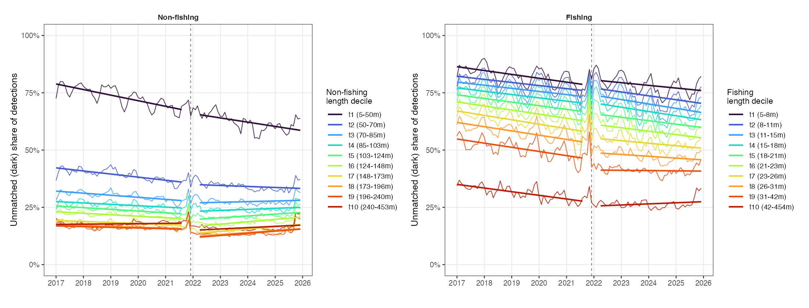
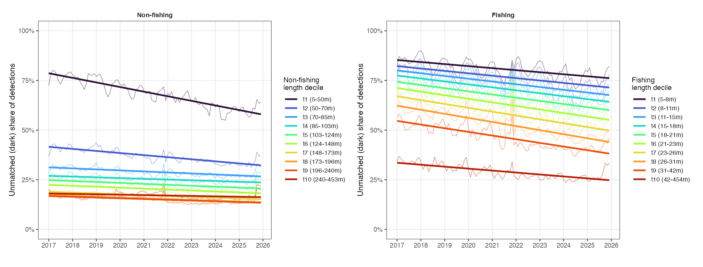

# Trends in the dark (unmatched) share of S1 vessel detections, 2017–2025

Analysis of how the fraction of Sentinel-1 vessel detections that cannot be matched
to an AIS broadcast has changed over time, disaggregated by fleet (fishing /
non-fishing) and by vessel length decile.

**Data:** `world-fishing-827.proj_ocean_ghg.rf_s1_detections_size_classified_paper_v20260714`,
monthly, 2017-01 to 2025-12. Deciles computed over the pooled all-month length
distribution, separately within each fleet.

---

## 1. Why we analyse the ratio, not the detection counts

### The Sentinel-1B failure

Sentinel-1B failed in **December 2021**. This halved the SAR constellation
overnight: the 6-day repeat cycle became a 12-day cycle for Sentinel-1A alone,
causing a large reduction in both spatial and temporal coverage, with some areas
seeing little or no coverage between December 2021 and April 2025.

The effect on the detection record is unambiguous and large:

| Group | Mean/month pre | Mean/month post | Ratio post/pre |
|---|---:|---:|---:|
| Fishing — total detections | 201,038 | 109,320 | 0.54 |
| Fishing — unmatched detections | 130,976 | 62,924 | 0.48 |
| Non-fishing — total detections | 153,605 | 107,421 | 0.70 |
| Non-fishing — unmatched detections | 43,270 | 26,674 | 0.62 |

Note the asymmetry: fishing detections fell to 0.54 of their prior level while
non-fishing fell only to 0.70. Fishing vessels concentrate in coastal waters,
where losing S1B's interleaved passes degrades revisit more than in the
open-ocean lanes non-fishing traffic uses. **The coverage loss was not uniform
across fleets**, so raw counts cannot be compared across the break even in
relative terms.

### Why the ratio solves this

For each month we compute:

```
dark share = unmatched detections / total detections
```

where "unmatched" means S1 saw a vessel but no AIS broadcast could be matched to
it (`detect_ssvid IS NULL`).

If the fleet is unchanged but half the satellite coverage disappears:

- unmatched detections → halve
- total detections → halve
- **the ratio → unchanged**

Losing coverage means seeing *fewer* vessels, but there is no reason it changes
*what kind* of vessels are seen. Numerator and denominator scale down together,
so the ratio divides the coverage loss out. The ratio measures a property of the
**fleet**; the counts measure a property of the fleet **confounded with the
observing system**.

This is why every substantive result below is stated in terms of the dark share.
Count-based trends were computed and are reported in §5 for completeness, but
they are not interpretable as fleet trends.

### Composition check

The ratio is coverage-invariant *within* a fixed group, but the aggregate ratio
could still move if coverage shifted *which* vessels get detected (e.g. toward
larger vessels more likely to carry AIS). This was tested directly — the detected
size mix barely moved across the break:

- Fishing: maximum shift in any decile's share of detections = **±0.006**
- Non-fishing: maximum shift = **±0.014**

Composition change is therefore not driving the aggregate trends. This is also
why the analysis is run per size decile rather than pooled only.

---

## 2. Era-split analysis

Trends fitted **independently within** each era, so the level shift at the break
is excluded and each era's slope reflects movement within that period alone.

- **Pre:** 2017-01 – 2021-09
- **Post:** 2022-04 – 2025-12
- **Excluded:** 2021-10 – 2022-03 (±3 months around the S1B failure)



*Dashed vertical line marks the S1B failure (Dec 2021). Thin lines are monthly
values; thick lines are within-era OLS fits. Note the transition spike at the
break, especially in fishing (~85%) — this falls inside the excluded window and
does not affect the fits.*

### Table 1 — Dark share: level and within-era slope, by decile

Slopes are change in dark fraction per year.
Significance: `*** p<0.001, ** p<0.01, * p<0.05, ns` not significant.

| Fleet | Bin | Pre mean | Pre slope | Sig | Post mean | Post slope | Sig | Pattern |
|---|---|---:|---:|:--|---:|---:|:--|:--|
| Non-fishing | t1 (5–50m) | 0.733 | −0.0244 | *** | 0.620 | −0.0185 | *** | ↓↓ persists |
| Non-fishing | t2 (50–70m) | 0.391 | −0.0135 | *** | 0.341 | −0.0043 | ns | ↓ → flat |
| Non-fishing | t3 (70–85m) | 0.300 | −0.0090 | *** | 0.275 | +0.0028 | ns | ↓ → flat |
| Non-fishing | t4 (85–103m) | 0.261 | −0.0061 | *** | 0.241 | +0.0045 | * | ↓ → ↑ |
| Non-fishing | t5 (103–124m) | 0.239 | −0.0075 | *** | 0.213 | +0.0080 | *** | ↓ → ↑↑ |
| Non-fishing | t6 (124–148m) | 0.216 | −0.0065 | *** | 0.188 | +0.0104 | *** | ↓ → ↑↑ |
| Non-fishing | t7 (148–173m) | 0.183 | −0.0044 | *** | 0.156 | +0.0100 | *** | ↓ → ↑↑ |
| Non-fishing | t8 (173–196m) | 0.166 | −0.0038 | *** | 0.141 | +0.0087 | *** | ↓ → ↑↑ |
| Non-fishing | t9 (196–240m) | 0.162 | −0.0031 | *** | 0.137 | +0.0095 | *** | ↓ → ↑↑ |
| Non-fishing | t10 (240–453m) | 0.178 | +0.0012 | ns | 0.162 | +0.0057 | * | flat → ↑ |
| Fishing | t1 (5–8m) | 0.825 | −0.0168 | *** | 0.781 | −0.0118 | * | ↓ persists |
| Fishing | t2 (8–11m) | 0.791 | −0.0135 | *** | 0.735 | −0.0170 | ** | ↓ steepens |
| Fishing | t3 (11–15m) | 0.765 | −0.0136 | *** | 0.700 | −0.0193 | *** | ↓ steepens |
| Fishing | t4 (15–18m) | 0.738 | −0.0144 | *** | 0.667 | −0.0187 | *** | ↓ steepens |
| Fishing | t5 (18–21m) | 0.705 | −0.0158 | *** | 0.627 | −0.0152 | ** | ↓ persists |
| Fishing | t6 (21–23m) | 0.669 | −0.0179 | *** | 0.581 | −0.0150 | *** | ↓ persists |
| Fishing | t7 (23–26m) | 0.626 | −0.0193 | *** | 0.529 | −0.0111 | ** | ↓ weakens |
| Fishing | t8 (26–31m) | 0.578 | −0.0185 | *** | 0.472 | −0.0079 | ** | ↓ weakens |
| Fishing | t9 (31–42m) | 0.507 | −0.0181 | *** | 0.410 | −0.0012 | ns | ↓ → flat |
| Fishing | t10 (42–454m) | 0.314 | −0.0159 | *** | 0.265 | +0.0048 | ns | ↓ → flat |

**Summary counts.** Pre-2022: 19 of 20 slopes significantly negative (only
non-fishing t10 flat). Post-2022: 10 significantly negative, 7 significantly
positive, 3 ns. **Every positive slope is non-fishing; every fishing bin is
negative or ns.**

### Interpretation of the era split

**Fishing declines throughout, at every size.** All 10 bins fall significantly
pre-2022, and 8 of 10 continue falling post-2022. Several mid-size bins actually
*steepen* (t3: −0.0136 → −0.0193). This is the most robust result in the analysis:
a trend that survives a major change in the observing system.

**Small non-fishing (t1, 5–50m) behaves like fishing** — the steepest decline
anywhere in the dataset (−0.0244/yr pre, −0.0185/yr post), significant in both eras.

**Mid-to-large non-fishing reverses sign exactly at the break.** t5–t9 all flip
from significantly negative to significantly positive (+0.008 to +0.010/yr, all
***). Statistically this is as strong as the declines. But significance answers
"is the slope non-zero", not "is this fleet behaviour" — a systematic measurement
change produces significant slopes just as readily.

**Evidence that the reversal is at least partly an artifact:**

1. The sign flip lands exactly at the break, not gradually.
2. There is a *generalised flattening* across the whole table, not just a
   non-fishing reversal: fishing t9 goes −0.018 → −0.001 (loses significance),
   fishing t10 goes −0.016 → +0.005 (loses significance).
3. Many independent series shifting positive at one instant is far more
   consistent with a common observational cause than with simultaneous
   behavioural change across unrelated fleet segments.

**Evidence against a pure artifact:** fishing t1–t8 keep declining significantly,
several at steeper rates. A uniform artifact should have pushed those positive
too. The effect is therefore size- and fleet-dependent, consistent with a
matching/reception mechanism that bites differently by vessel type.

**Assessment:** the mid-to-large non-fishing post-2022 reversal should be treated
as *requiring further validation*, not as an established finding of increased AIS
switch-off.

---

## 3. Full-period analysis

A single trend fitted over the whole 2017–2025 series per bin, deliberately
absorbing the S1B step and any post-2022 reversal into one slope. This tests
whether the overall story survives that simplification.



*Thin lines are monthly values; thick lines are single OLS fits over the full period.*

### Table 2 — Full-period trend in dark share, 2017-01 – 2025-12

Start/end are means of the first and last 6 months. All slopes per year.

| Fleet | Bin | Start | End | Rel. change | Slope/yr | Sig | R² |
|---|---|---:|---:|---:|---:|:--|---:|
| Non-fishing | t1 (5–50m) | 0.772 | 0.620 | −20% | −0.0232 | *** | 0.81 |
| Non-fishing | t2 (50–70m) | 0.409 | 0.352 | −14% | −0.0105 | *** | 0.71 |
| Non-fishing | t3 (70–85m) | 0.309 | 0.298 | −4% | −0.0051 | *** | 0.41 |
| Non-fishing | t4 (85–103m) | 0.266 | 0.264 | −1% | −0.0037 | *** | 0.30 |
| Non-fishing | t5 (103–124m) | 0.250 | 0.241 | −3% | −0.0048 | *** | 0.40 |
| Non-fishing | t6 (124–148m) | 0.227 | 0.221 | −3% | −0.0048 | *** | 0.35 |
| Non-fishing | t7 (148–173m) | 0.194 | 0.192 | −1% | −0.0042 | *** | 0.32 |
| Non-fishing | t8 (173–196m) | 0.177 | 0.176 | −0% | −0.0040 | *** | 0.31 |
| Non-fishing | t9 (196–240m) | 0.175 | 0.174 | −1% | −0.0038 | *** | 0.27 |
| Non-fishing | t10 (240–453m) | 0.185 | 0.193 | +5% | −0.0021 | *** | 0.11 |
| Fishing | t1 (5–8m) | 0.854 | 0.772 | −10% | −0.0103 | *** | 0.38 |
| Fishing | t2 (8–11m) | 0.817 | 0.724 | −11% | −0.0121 | *** | 0.44 |
| Fishing | t3 (11–15m) | 0.792 | 0.685 | −13% | −0.0139 | *** | 0.50 |
| Fishing | t4 (15–18m) | 0.768 | 0.655 | −15% | −0.0149 | *** | 0.57 |
| Fishing | t5 (18–21m) | 0.737 | 0.619 | −16% | −0.0159 | *** | 0.62 |
| Fishing | t6 (21–23m) | 0.703 | 0.572 | −19% | −0.0179 | *** | 0.70 |
| Fishing | t7 (23–26m) | 0.662 | 0.527 | −20% | −0.0194 | *** | 0.75 |
| Fishing | t8 (26–31m) | 0.611 | 0.474 | −23% | −0.0205 | *** | 0.76 |
| Fishing | t9 (31–42m) | 0.542 | 0.427 | −21% | −0.0185 | *** | 0.70 |
| Fishing | t10 (42–454m) | 0.346 | 0.300 | −13% | −0.0099 | *** | 0.53 |

### Table 3 — Fleet aggregates, full period

| Fleet | Start | End | Rel. change | Slope/yr | Sig |
|---|---:|---:|---:|---:|:--|
| Fishing | 0.670 | 0.570 | −15% | −0.0157 | *** |
| Non-fishing | 0.291 | 0.271 | −7% | −0.0066 | *** |

**All 20 bins have a significantly negative full-period slope (\*\*\* in every
case), with no exceptions in either fleet.** Fishing declines at more than twice
the non-fishing rate.

### Is the decline strongest in the smallest vessels?

Tested by Spearman correlation between decile rank and slope:

| Fleet | ρ | p | Reading |
|---|---:|---:|---|
| Non-fishing | +0.81 | 0.008 | Slope becomes less negative in larger bins — strongly monotone |
| Fishing | −0.42 | 0.232 | Not significant — no monotone size gradient |

**The "especially small vessels" framing holds for non-fishing but not for
fishing.**

- **Non-fishing:** strongly monotone. t1 falls 20%; t3–t9 barely move (−0% to −4%).
  The transformation is essentially *entirely* a small-vessel phenomenon.
- **Fishing:** an inverted U, not a gradient. Steepest in the **middle**
  (t7–t9, 23–42m, at −20% to −23%), shallower at both ends. The smallest fishing
  vessels (t1, 5–8m) have the *shallowest* decline of the fishing bins (−10%).

Why the extremes are shallow in fishing: t1 starts at 85% dark and remains 77% —
very small fishing vessels are largely outside AIS carriage requirements and
remain so. t10 starts at 35%, already relatively light, with less room to fall.
The action is in the **mid-size fishing fleet**, the segment most plausibly
affected by expanding carriage rules.

### A caution on reading Table 2

The R² column matters. Fishing mid-bins reach 0.70–0.76, so a single line
genuinely describes those series. Non-fishing t3–t10 sit at 0.11–0.41, meaning
the line explains little — those are exactly the bins where the pre/post reversal
lives, and the full-period slope is a weak summary even though significant.

Non-fishing t10 is the clearest case: the slope is significantly negative
(−0.0021\*\*\*) yet the endpoints are *higher* at the end than at the start (+5%).
The negative slope comes from the middle of the series, not the net movement.
**For non-fishing above ~70m, Table 1 (era-split) is the more faithful description.**

---

## 4. Level structure: smaller vessels are darker

Independent of any trend, the dark share is strongly size-graded in both fleets:

| | Smallest bin | Largest bin |
|---|---|---|
| Fishing | 85% dark (5–8m) | 31% dark (42m+) |
| Non-fishing | 77% dark (5–50m) | ~18% dark (240m+) |

Large commercial vessels are subject to AIS carriage requirements and mostly
comply; small vessels — especially small fishing vessels — often are not and
often do not.

---

## 5. Count-based trends (not interpretable as fleet trends)

Reported for completeness. These confound fleet change with coverage change and
should **not** be read as fleet trends — see §1.

| Group | Era | Mean/mo | Slope/yr | %/yr | Sig |
|---|---|---:|---:|---:|:--|
| Fishing — total | Pre | 201,038 | +5,150 | +2.6% | ns |
| Fishing — total | Post | 109,320 | −3,798 | −3.5% | ns |
| Fishing — unmatched | Pre | 130,976 | +494 | +0.4% | ns |
| Fishing — unmatched | Post | 62,924 | −3,940 | −6.3% | * |
| Non-fishing — total | Pre | 153,605 | +6,728 | +4.4% | *** |
| Non-fishing — total | Post | 107,421 | +3,412 | +3.2% | ** |
| Non-fishing — unmatched | Pre | 43,270 | +702 | +1.6% | ns |
| Non-fishing — unmatched | Post | 26,674 | +861 | +3.2% | ns |

The apparent post-2022 fishing "decline" (−3.5%/yr) is the weakest result here:
the pre-era slope is not significant, so the pattern is really "flat then down",
and the level drop to 0.54 is entangled with fishing's coastal concentration
being hit harder by the S1B loss. Similarly, coverage recovered progressively
through April 2025, which likely inflates the non-fishing +3.2%/yr post-era slope.

---

## 6. Conclusions

1. **There is a broad, significant decline in the dark share of detected vessels
   across all vessel classes, 2017–2025.** All 20 fleet × decile bins show a
   significantly negative full-period slope, and 19 of 20 were significantly
   negative pre-2022. The direction is robust to how the series is fitted.

2. **The decline is strongest in fishing** (−15% relative, −0.0157/yr) — more than
   twice the non-fishing rate (−7%, −0.0066/yr).

3. **Within non-fishing, the decline is a small-vessel phenomenon** (ρ = +0.81,
   p = 0.008). Vessels 5–50m fell 20%; everything above 70m moved by ≤4%.

4. **Within fishing, the decline is strongest in mid-size vessels** (23–42m,
   −20% to −23%), not the smallest. The smallest fishing vessels remain
   overwhelmingly dark (85% → 77%).

5. **Mechanism is not identifiable from this data.** A declining dark share is
   consistent with increased AIS *carriage* (more vessels fitted and
   transmitting), improved AIS *reception* (more satellite receivers hearing
   existing broadcasts), or improved *matching* between S1 detections and AIS
   tracks. All three produce an identical curve here. Statements should say
   "consistent with expanding AIS carriage and/or improving satellite AIS
   reception" rather than attributing to adoption alone.

6. **The post-2022 reversal in mid-to-large non-fishing vessels is unresolved.**
   It is statistically strong but coincides exactly with the S1B failure, and is
   accompanied by a generalised flattening across other bins. Treat as requiring
   validation, not as evidence of increased AIS switch-off.

### Suggested framing

> Between 2017 and 2025 the share of satellite-detected vessels not matched to an
> AIS broadcast declined significantly across every vessel class examined. The
> decline was strongest among fishing vessels (−15% relative) and among small
> non-fishing vessels under 50m (−20%), consistent with expanding AIS carriage
> and/or improving satellite AIS reception over the period. Because the
> Sentinel-1B failure in December 2021 substantially reduced SAR coverage, these
> trends are expressed as the unmatched *share* of detections rather than
> detection counts, which are confounded with observing capacity.

### Recommended follow-up

The decisive test for conclusion 6 is to repeat the analysis restricted to grid
cells with **consistent imaging before and after** the break. If the mid-to-large
non-fishing reversal disappears under that control it is a coverage artifact; if
it survives it is fleet behaviour. The fields `s1_imaged` and
`pixel_area_imaged_m2` in `rf_model_features_paper_v20260714` support this.

---

## Methods notes

- **Deciles** are computed over the pooled all-month length distribution,
  separately within each fleet (`NTILE(10) OVER (PARTITION BY fishing ORDER BY
  length_m)`). Cutoffs are therefore fixed in time, so a change in a series
  reflects change within a fixed size range. Fishing and non-fishing deciles span
  very different length ranges (fishing t10 = 42m+; non-fishing t10 = 240m+) and
  are **not** comparable bin-for-bin across fleets.
- **Trends** are OLS of the monthly dark fraction on time in years. No
  autocorrelation correction is applied; monthly series are seasonally
  autocorrelated, so reported p-values are likely anti-conservative. The
  qualitative conclusions rest on effect sizes and consistency across 20
  independent bins rather than on individual p-values.
- **Era split** excludes 2021-10 – 2022-03 (±3 months around the S1B failure) to
  keep the transition out of both fits.
