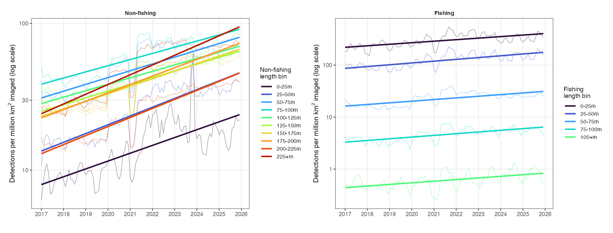
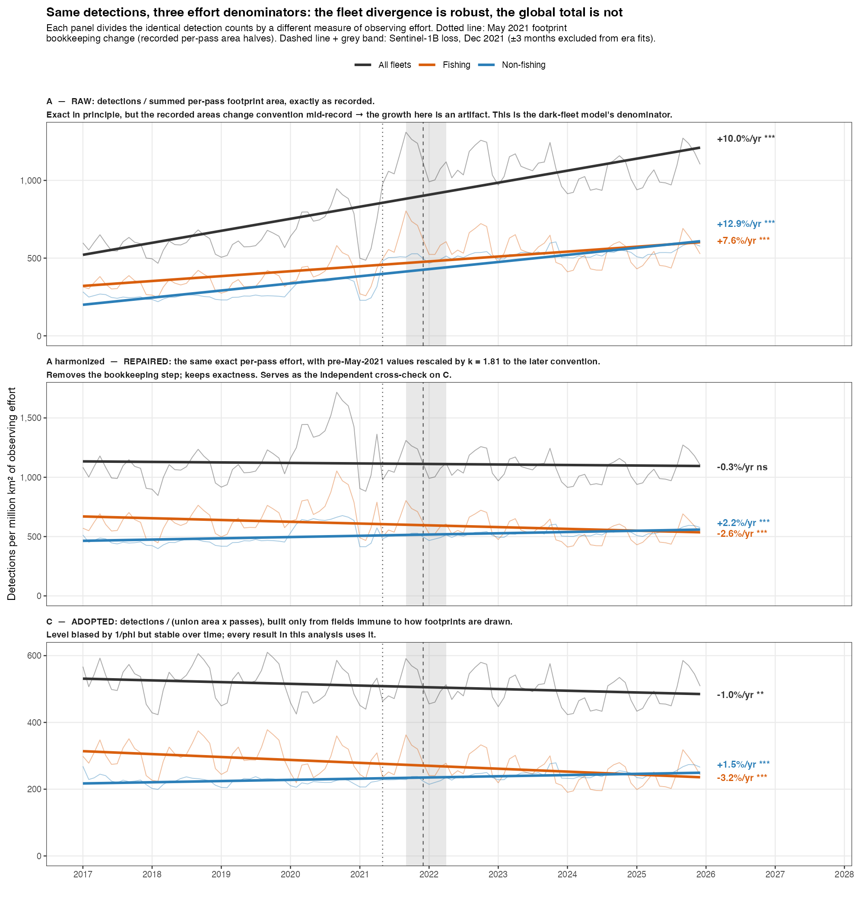

# Is detected fleet activity increasing? Normalising S1 detection density against a changing observing system

Companion to [issue #9](https://github.com/emlab-ucsb/paper-ocean-ghg/issues/9#issue-5094955487).
That document asked *what share* of detected vessels are dark and how that
evolves. This one asks a harder question: **is the amount of vessel activity S1
detects going up or down?**

**Data:** `rf_model_features_paper_v20260714` and
`s1_pixel_area_imaged_by_scene_v20260714`, monthly, 2017-01 to 2025-12,
disaggregated by fleet (fishing / non-fishing) and by the model's native length
size bins (10 non-fishing, 5 fishing).

**How this document is organised.** The investigation went through four stages,
and the document preserves that progression — including the places where an
earlier interpretation was later shown to be wrong:

- **Part I** finds a workable normalisation empirically (three candidate
  denominators, one winner).
- **Part II** works out *why* the winner is right, from the physics of the
  detection process up — and in doing so discovers a data-pipeline discontinuity
  (May 2021) that reframes Part I, and retracts one of Part I's interpretations.
- **Part III** validates the instrument and the normalisation against AIS ground
  truth, and attributes the remaining discontinuities (a matched-detections
  control test, refined per size bin and per region).
- **Part IV** states the final answer with confidence gradings.
- **Part V** lays out the implications for the dark fleet emissions model,
  including the May 2021 issue.

---

## 0. Definitions — the quantities and indices used throughout

### Raw quantities (per 1°×1° cell, per month)

| Quantity | Source | Meaning |
|---|---|---|
| Matched detections | `rf_model_features` | S1 detections matched to an AIS-broadcasting vessel |
| Unmatched (dark) detections | `rf_model_features` | S1 detections with no AIS match |
| `number_s1_scenes` | coverage table | Number of S1 passes over the cell that month |
| `union_imaged_m2` | coverage table | Ocean area imaged **at least once** (bounded by cell area) |
| `summed_imaged_m2` | coverage table | Per-pass footprint areas **summed over passes** (unbounded) |
| `ais_vessel_hours` | `rf_model_features` | Hours of AIS-broadcasting vessel presence in the cell (per fleet and length bin; independent of S1) |

A key fact about detections: **they are anonymous and counted per pass.** A
vessel that sits in one cell all month and is imaged on three passes produces
*three* detections, indistinguishable from three different vessels seen once
each. There is no vessel identity in the detection record (only estimated length
and a fishing / non-fishing classification).

### Derived indices

#### The unit of observing effort: an "opportunity"

An **opportunity** is one chance to see one patch of ocean — a single pass over
a single area. This is the unit that all detection rates in this document are
expressed per, and "denominator C" is simply the count of opportunities:

```
opportunities = union_imaged_area × number_of_passes        [km² · passes]
```

A 1°×1° cell whose water was covered on 3 passes in a month contributes
3 × (its imaged area) opportunities. Two passes over the same water count as
**two** opportunities, because each is a separate chance to detect whatever was
there at that moment. (Passes that cover only *part* of the cell are the
approximation in this formula — see below.)

**Why the pass count must be in there.** Detections are anonymous and generated
per pass (see above), so raw detection counts scale with how *often* you look,
not only with how much fleet is present. Worked example: a cell holds 10 vessels
that never move, and the whole cell is imaged on every pass.

| Passes that month | Detections recorded | ÷ union area alone | ÷ union area × passes |
|---:|---:|---|---|
| 3 | 30 | 30/area — *looks like 30 vessels* | 10/area ✓ |
| 6 | 60 | 60/area — *looks like a doubling* | 10/area ✓ |

Nothing changed at sea, yet detections doubled, because each pass records
everyone again. Dividing by area alone reports a spurious doubling; dividing by
opportunities recovers the right answer. **This holds for completely stationary
vessels** — it is not an assumption about vessel movement (§7).

**What `union area × passes` assumes — and where it is only approximate.** The
formula treats every pass as covering the same area (the union). Real passes do
not: one may cross the full pixel while the next clips only half of it. The exact
count of opportunities is the per-pass sum,

```
true opportunities = Σ over passes ( area covered by that pass )
                   = union area × Σ over passes ( fraction of union covered )
                   = union area × "effective passes"
```

which is exactly what `summed_imaged_m2` is meant to be — i.e. **denominator A is
the exact quantity, and C is an approximation** that replaces effective passes
(e.g. 1.5 for one full pass plus one half pass) with the raw pass count (2),
assuming a constant fractional coverage per pass. The per-pass areas needed for
the exact version exist upstream (`s1_pixel_area_imaged_by_scene` is per-scene);
the reason this document does not use them raw is not availability but
reliability — the recorded polygons are the field with the May 2021 convention
change and the pre-2021 drift (below, and §8). The ratio `summed / (union × passes)` *is* that mean
fraction, so C is exact only where that ratio is constant. Measured (§8):

| Period | Mean fraction of the union covered per pass |
|---|---:|
| 2017–2020 | 0.83 |
| 2021 Jan–Apr | 0.85 |
| 2021 May–Sep | 0.46 |
| Post-2022 | 0.46 |

Passes cover ~83% of the union before May 2021 and ~46% after — never 100%. So C
**overstates** observing effort (by 1/0.83, then 1/0.46) and correspondingly
understates density in absolute terms. What matters is that the fraction is
*stable within each regime*: a constant multiplier cancels out of every ratio and
every log-slope, which is all this document uses (steps and %/yr, never absolute
density levels).

**So why not use A, if it is exact?** Because its *recorded* values change
convention mid-record: that same ratio jumps 0.83 → 0.46 overnight in May 2021
while detections, union area, and pass counts are all continuous (§8). A is exact
in principle but discontinuous in practice; C is biased in level but the bias is
constant except across that one date. Union area and pass count are both immune to
how the footprint polygons are drawn, so C is A rebuilt from fields that do not
shift mid-record. This is the central trade-off of the whole analysis, and §7–8
develop it in full.

**Measured stability of the constant-fraction assumption** (monthly φ =
summed/(union×passes), fitted per recording convention): under the post-May-2021
convention φ is drift-free (+0.01%/yr, p=0.89) and moves only **+1.2%** across the
S1B break — so the approximation contaminates the headline break steps by ~1%,
against signals of ±10–15%. Under the pre-May-2021 convention φ is *not* stable
(−7.8%/yr, p<0.001), which affects pre-era slopes specifically — see §16 for the
full consequence inventory and the harmonized-A cross-check.

#### Detection density (the activity index used for all final results)

```
density = detections / opportunities        [detections per km²·pass]
```

Applied to three numerators, always with **the same denominator**:

```
matched detections per opportunity = matched detections / (union area × passes)
dark    detections per opportunity = dark    detections / (union area × passes)
total   detections per opportunity = all     detections / (union area × passes)
```

There is no such thing as a "matched opportunity" — an opportunity does not know
what kind of vessel it will contain, or whether that vessel will turn out to be
matched. "Matched detections per opportunity" means *per chance to observe, how
many of the things seen were matched vessels.*

Because the denominator is shared, the three are **additive**:

```
matched/opp + dark/opp = total/opp
```

This is what makes the reshuffle in Part III readable: at the break, non-fishing
matched/opp rose to 1.15 while dark/opp fell to 0.97, yet the total moved only to
1.10 — components trading places within a near-stable sum. With per-series
denominators that arithmetic would not hold, and the reshuffle could not be
interpreted as reclassification.

#### What can be compared with what — the cancellation hierarchy

Not every comparison between these indices carries the same robustness. Three
tiers, from strongest to weakest:

**Tier 1 — same-denominator series against each other (matched vs dark vs
total): everything cancels, even time-varying errors.** Because the denominator
is identical, any comparison *between* them — a ratio, a divergence, the mirror
pattern — reduces to a pure detection-count ratio:

```
(matched/opp) ÷ (dark/opp) = matched detections / dark detections
```

The denominator drops out completely: φ drift, the May 2021 snap, the S1B
break — all of it hits both series identically and vanishes. These comparisons
sit in the same coverage-invariant class as the dark share (they are the same
information re-arranged: dark share = dark/(matched+dark)). The matched-vs-dark
reshuffle is therefore the single most robust signal in this document.

**Tier 2 — one series against its own baseline (indexed relative change):
constant biases cancel; time-varying ones do not.** Indexing divides out any
constant multiplier, including the 1/φ level bias — so the stability-for-
exactness trade never affects an indexed series. What survives is drift in how
well the denominator tracks true effort, which is measured and bounded in
§16.4 (~±3% on steps, ~±0.7%/yr on slopes; larger ambiguity pre-May-2021).

**Tier 3 — across different denominators (e.g. AIS presence, hours/union,
against detections/(union × passes)): the weakest, assumption-bearing tier.**
Comparing their relative changes assumes each denominator tracks its own target.
The backstop is that union area is the most stable field in the dataset
(49–53 Mkm² across nine years), and the signals compared this way (e.g. AIS
presence ×2.4 vs benchmark ×0.79 for fishing) dwarf any denominator subtlety.

One caveat lives outside this hierarchy because it concerns *numerators*: a
Tier-1 comparison proves detections reclassified from dark to matched, but
cannot by itself separate *why* — the same vessels becoming matchable (reception
/matching) versus newly broadcasting vessels arriving (carriage). Both raise
matched; the former also lowers dark. See §21.

**AIS presence index** (S1-independent measure of broadcasting-vessel activity):

```
AIS presence = ais_vessel_hours / union area          [vessel-hours per km²]
```

summed over the same imaged cell-months as the detections.

**Detection efficiency index** (the instrument check, Part III):

```
efficiency = matched detections / Σ over cells ( ais_vessel_hours × passes )
```

"Of the vessel-hours AIS tells us were present, how many detections did S1
produce per pass?" The per-cell product before summing matters: it makes the
index insensitive to observing effort moving between cells, because each cell's
expected matches scale with its own presence × passes.

**This is the one index whose denominator is not opportunities.** Instead of
area × passes it uses *AIS-known presence* × passes — so it genuinely is "per
chance to observe a vessel we already know was there." That substitution is what
turns it from an activity measure into an instrument check: the number of vessels
appears in both numerator and denominator and cancels, leaving only the question
of whether S1 detected them. It is also why the index is only readable where AIS
coverage was already saturated — if the denominator itself inflates with new
visibility, the ratio falls with no change in instrument performance (§11).

**Step at the break:** ratio of the post-era mean to the pre-era mean of a
monthly series. Pre = 2017-01 – 2021-09; Post = 2022-04 – 2025-12; the six
months around the Sentinel-1B failure (Oct 2021 – Mar 2022) are excluded.
A step of 1.00 means no discontinuity; 1.10 means 10% higher after; 0.85 means
15% lower after.

**Era slopes:** OLS of log(index) on time within each era, reported as %/yr.

### Which index answers which question — validity conditions

| Index | Question it answers | Valid when |
|---|---|---|
| AIS presence | How much vessel activity is *AIS-visible*? | Never a fleet-size measure on its own — it moves with reception and adoption, not only with vessels |
| Efficiency | Is the S1 instrument (detection per opportunity) stable? | **Only where AIS visibility was already saturated** — otherwise adoption contaminates it |
| Density (detections/effort) | How much vessel activity is S1 seeing? | Where the instrument has been verified stable |

Efficiency can never measure abundance: the number of vessels cancels out of it
by construction (it is *per known-present vessel-hour*). A rising efficiency
does not mean more vessels; a rising density (with verified instrument) does.

---

# Part I — Finding a workable normalisation

## 1. Why this question is much harder than the dark-share question

The dark share is a **ratio of two quantities counted over the same pixels**:

```
dark share = unmatched detections / total detections
```

Halve the satellite coverage and both numerator and denominator halve; the ratio
is untouched. It never references imaged area at all, so it is invariant to the
observing system *by construction*. That is why the dark-share results survived
the Sentinel-1B failure unchanged.

Detection **density** has no such protection: its denominator is an explicit
measurement of observing effort, and it is only trustworthy if detections and
that effort measure scale together when the observing system changes.

The observing system changed three times:

| Event | Date | What actually changed |
|---|---|---|
| Footprint bookkeeping (§7) | ~May 2021 | *Recorded* area per scene halved; passes, union area, detections all continuous |
| Sentinel-1B failure | Dec 2021 | Cells −18%, passes per cell −35%, repeat cycle 6 → 12 days |
| Coverage recovery | through Apr 2025 | Gradual, partial |

The May 2021 event is not documented in the manuscript and was discovered during
this analysis. Part II shows it is a data-pipeline artifact, not a physical
coverage change.

## 2. First attempt, and two rejected explanations

The first density series used `pixel_area_imaged_m2` from the feature matrix —
which is `summed_imaged_m2`, the same denominator the dark fleet model's target
variable uses (call it **denominator A**).


*Detection density under denominator A. Log y-axis. Note the dip during 2021 and
the jump at the break — both later shown to be denominator artifacts.*

Fitted trends looked emphatic — every bin rising at +10 to +17%/yr, all
p<0.001. Taken at face value, detected activity doubled in eight years.


But the era-split view shows every bin stepping up by 1.46–2.17× at the break,
with the steps clustering tightly *within* each fleet. A uniform multiplicative
jump across fifteen unrelated vessel classes at one instant is a denominator
signature, not fleet growth. Two candidate explanations were tested and
rejected:

**(a) Spatial composition** — perhaps S1 retreated to busier water. Tested with
a balanced panel (cells imaged in both eras) and a post-2022 core footprint
(cells imaged in ≥80% of post-break months):




<!-- TODO: upload figures/fig-density-core-fullperiod.png to this issue and replace the
     local reference above with its  tag. It is the only figure still local. -->


The restriction removed only ~7% of area and shrank the step from 1.91 → 1.81
(non-fishing) and 1.50 → 1.42 (fishing). **The cells were never the problem.**

**(b) Detection-conditional selection** — perhaps the denominator only counts
cells where something was detected. Tested directly: the feature table is a
complete rectangular grid (every bin, every imaged cell-month), zeros stored
explicitly, and **74–78% of imaged rows contain zero detections**. The
denominator counts empty water, as it should. Unfounded.

## 3. The three coverage quantities

The upstream SQL (`s1_ratios_rf/sql/s1/s1_pixel_area_imaged_by_scene.sql`)
computes three effort measures per cell-month, by intersecting the full marine
cell grid with every overlapping scene footprint — entirely independent of
whether any vessel was detected:

```
summed_imaged_m2 = SUM(per-scene intersection area)        [revisit-weighted, unbounded;
                                                            the density-target denominator]
union_imaged_m2  = ST_AREA(ST_UNION_AGG(per-scene geom))   [area imaged >=1x, bounded]
number_s1_scenes = COUNT(DISTINCT scene_id)                [revisit count]
```

Only `summed_imaged_m2` is carried into `rf_model_features`. The other two made
the comparison below possible.

## 4. Decomposing the coverage change

| Period | Cells | Summed area (Mkm²) | Area/cell (km²) | Passes/cell |
|---|---:|---:|---:|---:|
| 2017–2020 | 9,578 | 588 | 61,320 | 2.90 |
| 2021 Jan–Apr (the dip) | 9,622 | 633 | 65,736 | 2.94 |
| 2021 May–Sep | 9,641 | 346 | 35,863 | 3.01 |
| Post-2022 | 7,896 | 202 | 25,625 | 2.21 |

Two separable events. In **May 2021**, cell count and passes per cell are flat,
yet recorded area per cell falls 45% — same cells, same passes, half the
recorded area per pass. In **Dec 2021**, cells fall 18% *and* passes per cell
fall 26% — the genuine constellation loss. (Part I initially read May 2021 as a
physical "footprint extent change"; Part II corrects this to a bookkeeping
change.)

## 5. Three candidate denominators and the step test

If a denominator correctly describes how detections scale with observing
effort, dividing by it should leave **no step at the break** — the satellite
failure changed the observing system, not the ocean.

| Denominator | Formula | Counts a repeat pass as |
|---|---|---|
| **A** | summed footprint area | fully additional effort, using recorded per-pass polygons |
| **B** | union area | no additional effort at all |
| **C** | union area × passes | fully additional effort, using bounded coverage × pass count |


**Step at the break (1.00 = no discontinuity):**

| Denominator | Non-fishing | Fishing |
|---|---:|---:|
| A. Summed area | 1.83 | 1.44 |
| B. Union area | 0.74 | 0.58 |
| **C. Union × passes** | **1.10** | **0.85** |

A and B fail in opposite directions; C lands closest to 1.00 in both fleets and
is the only series that runs flat through the break in the figure. The
denominator table shows why: union area barely moves across nine years
(51.7 → 49.2 Mkm²) while summed area collapses 560 → 202 — the entire
difference is passes and footprint bookkeeping, which C separates and A
conflates.

## 6. Results under denominator C


**Full-period trends, A vs C:**

| Fleet | Bin | A (summed) | **C (union × passes)** | C: R² |
|---|---|---:|---:|---:|
| Non-fishing | 0-25m | +13.4% *** | +2.0% * | 0.05 |
| Non-fishing | 25-50m | +15.1% *** | +3.5% *** | 0.42 |
| Non-fishing | 50-75m | +11.6% *** | +0.4% ns | 0.01 |
| Non-fishing | 75-100m | +10.4% *** | −0.7% ** | 0.07 |
| Non-fishing | 100-125m | +10.9% *** | −0.2% ns | 0.00 |
| Non-fishing | 125-150m | +11.4% *** | +0.2% ns | 0.00 |
| Non-fishing | 150-175m | +12.8% *** | +1.5% *** | 0.33 |
| Non-fishing | 175-200m | +14.3% *** | +2.8% *** | 0.56 |
| Non-fishing | 200-225m | +15.5% *** | +3.9% *** | 0.68 |
| Non-fishing | 225+m | +16.7% *** | +5.0% *** | 0.78 |
| Fishing | 0-25m | +7.3% *** | −3.5% *** | 0.24 |
| Fishing | 25-50m | +8.4% *** | −2.4% *** | 0.16 |
| Fishing | 50-75m | +7.7% *** | −3.1% *** | 0.40 |
| Fishing | 75-100m | +7.8% *** | −3.0% *** | 0.25 |
| Fishing | 100+m | +6.9% *** | −3.8% *** | 0.10 |

The choice of denominator reverses the conclusion: under C, **fishing declines
in every bin** and **non-fishing shows a U-shape** — growth at both ends of the
size spectrum (+2.0/+3.5%/yr below 50m, +2.8 to +5.0%/yr above 175m) with the
50–150m mid-range flat.

At the end of Part I, C's justification was purely empirical ("it minimised the
step"), the residual steps (1.10 / 0.85) were unattributed, and the fact that
different denominators seemed to "suit" different fleets was unexplained. Parts
II and III resolve all three.

## 6b. The aggregate picture, and what each denominator does to it

Everything above is per size bin. Pooling to fleet level — legitimate because the
denominator is shared, so densities are additive (§0) — gives the summary figure
for the whole analysis, and shows at a glance how much of the answer is the
denominator's doing.



*Identical detection counts in all three panels; only the effort denominator
differs. Thin lines: monthly values. Thick lines: full-period OLS fit, labelled
with %/yr and significance. Dotted line: the May 2021 footprint bookkeeping
change (§8). Dashed line and grey band: the Sentinel-1B loss and the ±3-month
window excluded from era fits.*

**The three panels, in order:**

| Panel | What it is | What it represents |
|---|---|---|
| **A — raw** | detections ÷ summed per-pass footprint area, exactly as recorded | The theoretically exact effort measure (§7), and **the dark-fleet model's own denominator** — but computed from recorded polygons whose convention changes mid-record |
| **A harmonized** | the same exact per-pass effort, with pre-May-2021 values rescaled by k = 1.81 | A **repair** of A: the bookkeeping step spliced out so one number means the same thing across the record. Keeps exactness, removes the discontinuity |
| **C — adopted** | detections ÷ (union area × passes) | Built only from fields immune to how footprints are drawn. Level-biased by 1/φ but stable in time; **every result in this document uses it** |

**What "harmonized" means.** Denominator A is conceptually right but its recorded
values change units partway through: the mean fraction of the union covered per
pass is ≈0.83 before May 2021 and ≈0.46 after (§8), a factor of 1.81, overnight,
while detections, union area and pass counts are all continuous. Harmonized-A
multiplies the earlier era by that measured factor k = 1.81 to express the whole
series in the later convention — the same operation as splicing a rebased price
index or a relocated weather station. It is still denominator A, still the exact
per-pass sum, simply in consistent units end to end. Its role here is as an
**independent cross-check on C**: the two make opposite trade-offs (C avoids the
polygons entirely but assumes constant per-pass coverage; harmonized-A keeps
exactness but must be hand-repaired), so agreement between them is meaningful.
Full derivation and the measured φ series are in §8 and §16.4.

**Fleet-level slopes, full period:**

| Series | A (raw) | A harmonized | C (adopted) |
|---|---:|---:|---:|
| Non-fishing | +12.9% *** | **+2.2% *** | **+1.5% *** |
| Fishing | +7.6% *** | **−2.6% *** | **−3.2% *** |
| All fleets | +10.0% *** | **−0.3% ns** | **−1.0% ** |

Three things follow, and they frame the rest of the document:

1. **The raw-A panel is the artifact, and it is highly significant.** Every
   series appears to grow at 8–13%/yr, all at p<0.001. Panels 1 and 2 use the
   *same* per-pass areas and differ only by the splice, so the entire difference
   between them is bookkeeping — that one correction turns +10.0%/yr into
   −0.3%/yr. Significance offers no protection when the denominator is the
   problem. (The straight line in panel 1 is fitted through a step
   discontinuity, so it is not a meaningful trend estimate; it is shown to
   demonstrate what a naïve fit to the recorded field produces.)
2. **The fleet divergence is robust.** Harmonized-A and C share no denominator
   construction — one uses the polygons, the other never touches them — yet both
   give fishing declining ~2.6–3.2%/yr and non-fishing rising ~1.5–2.2%/yr, all
   at p<0.001. Two measures with different weaknesses agreeing is the strongest
   evidence available here.
3. **The global total is not robust.** −1.0% ** under C becomes −0.3% ns under
   harmonized-A. This is expected: the aggregate is two strong opposing trends
   nearly cancelling (R² = 0.07 under C), so it has no margin against the
   ~±0.7%/yr method uncertainty (§16.4). **The aggregate is not a meaningful
   summary of this dataset** — the divergence is the result. Composition makes
   the same point: the fishing share of all detections per opportunity falls from
   56.7% (2017) to 48.8% (2025) while the total moves 534 → 493.

---

# Part II — Why C is actually right: theory, and the May 2021 discovery

## 7. Deriving the correct denominator from the detection process

Start from how detections are generated. Every vessel above threshold inside a
pass's footprint at the instant of the pass yields one detection — anonymous,
once per pass. So the expected monthly count in a cell is:

```
E[detections] = Σ over passes ( vessel density at pass time × footprint area of that pass )
              = density × summed footprint area        (for stationary density)
```

Two consequences, both initially counter-intuitive:

1. **Vessel movement is irrelevant to the mean.** A stationary vessel counts
   once per pass; a transiting vessel is caught with probability proportional to
   its dwell time. Either way the expected count per pass is density × area.
   Movement affects the *variance* of the estimate, never its expectation.
   (An earlier version of this document interpreted the denominators as
   assumptions about vessel mobility — "A fits mobile fleets, B fits static
   ones." That interpretation is wrong and is retracted below.)
2. **Denominator A — with correct footprints — is the theoretically exact
   estimator.** Detections divided by true summed per-pass area equals average
   presence density, invariant to revisit rate and swath size, for any fleet.

But A failed the step test spectacularly (1.83 / 1.44). Since the theory says A
should work, one of its inputs must be broken. It is.

## 8. The May 2021 bookkeeping discontinuity

Form one ratio from the coverage table: `summed / (union × passes)` — the mean
fraction of a cell's footprint each recorded pass covers:

| Period | Summed (Mkm²) | Union×passes (Mkm²) | **Ratio** |
|---|---:|---:|---:|
| 2017–2020 | 560.4 | 676.7 | **0.83** |
| 2021 Jan–Apr | 607.6 | 711.3 | **0.85** |
| 2021 May–Sep | 332.0 | 725.3 | **0.46** |
| Post-2022 | 202.3 | 438.1 | **0.46** |

The ratio's era means sit at ~0.83–0.85, snap to 0.46 in May 2021, and hold at
0.46 afterwards — **straight through the Dec 2021 satellite failure** (monthly
fits: drift-free at +0.01%/yr after May 2021, with only a +1.2% step at the S1B
break). Meanwhile detections, union area, pass counts, and imaged-cell counts are
all continuous through May 2021. Only the recorded per-pass polygons changed.
One refinement matters, though: *within* the old convention the ratio is not
constant — it drifts at −7.8%/yr (p<0.001) on top of the Jan–Apr 2021 balloon.
The recorded summed-area field misbehaves three ways (drift, balloon, snap), not
one; the consequences for pre-era slopes are laid out in §16.

**Best-guess mechanism (unconfirmed):** scene footprint polygons previously
overlapped along-track, and per-scene intersection areas double-counted the
overlap, while the detections themselves are deduplicated (a vessel in the
overlap of two same-pass scenes is counted once, its area twice). A processing
change in `detect_foot_raw` removed the overlap. This is directly checkable in
the footprint-generation history — e.g., polygon overlap of consecutive
same-orbit scenes, April vs June 2021.

**The consequence reframes Part I.** Because summed = 0.46 × (union × passes)
exactly from May 2021 onward, **denominators A and C are proportional after
that date** — they carry identical information. All of the difference between
them lives in the pre-May-2021 era, where A's recorded denominator was inflated
~1.8× relative to the later convention. Check: A's step should exceed C's by
(pre-era ratio / post ratio) ≈ 0.80 / 0.46 ≈ 1.7. Observed: 1.83/1.10 = **1.66**
for non-fishing and 1.44/0.85 = **1.69** for fishing — the same factor for both
fleets, as a denominator-only effect must be.

So the correct statement is not "C's sampling model fits best." It is:

> **A is the right estimator, but its recorded denominator has a mid-record
> redefinition. C is A rebuilt from the two coverage fields (union area, pass
> count) that do not depend on how footprint polygons are drawn.** C's added
> assumption — each pass covers a constant fraction of the cell's footprint —
> is verified to hold after May 2021 (drift-free, +1.2% at the break) but is
> violated by the recorded data before it (−7.8%/yr drift plus the balloon and
> the snap). Post-2021 results and the break steps therefore rest on measured
> ground; pre-era *slopes* are convention-dependent (§16).

This also explains the "2021 dip" in the denominator-A figures (recorded area
ballooned in Jan–Apr 2021 and then halved in May, while detections barely
moved), and why C shows no dip.

## 9. Retraction: the fleet × denominator story was arithmetic, not physics

Part I-era analysis noted that A seemed to "suit" fishing (smaller step) while
B seemed to suit non-fishing, and a companion test with denominator B confirmed
the mirror image:


| Mean \|log step\| (0 = perfect) | Non-fishing | Fishing |
|---|---:|---:|
| A (summed) | 0.629 | 0.365 |
| B (union) | 0.275 | 0.542 |
| C (union × passes) | 0.120 | 0.155 |

This looked like fleets interacting differently with sampling. **It cannot be.**
Every denominator is built from the same coverage fields, which are identical
for both fleets — a denominator can only multiply both fleets' steps by a
common factor. Verify: the fleet gap (non-fishing step ÷ fishing step) is
1.83/1.44 = 1.27 under A, 1.10/0.85 = 1.29 under C, 0.74/0.58 = 1.28 under B —
constant. And B = C × (pass ratio 8.39/12.83 = 0.654) predicts steps of 0.72 and
0.56 against observed 0.74 and 0.58.

The "mirror" is therefore pure arithmetic: each fleet has one intrinsic step
under the clean denominator (non-fishing **1.10**, fishing **0.85** — one above
1, one below), and A's bookkeeping inflation (×1.66) happens to push fishing
back toward 1 while B's pass-division (×0.654) pushes non-fishing back toward 1.
A within-cell stratified test (same cells, same revisit change, only the fleet
differing) confirmed the fleet gap is constant (1.26–1.31) at every level of
revisit change — so it is not geography either.

**What survives as a real, denominator-independent fact:** at the constellation
change, detections per opportunity moved **+10% for non-fishing and −15% for
fishing**. Attributing that pair — instrument vs. reality — is what Part III
does.

---

# Part III — Validating against AIS ground truth

## 10. The matched-detections control test: design

Everything so far normalised *coverage*. What it could not check is the
*instrument*: whether one pass in 2023 detects a present vessel as reliably as
one pass in 2019 did. For that we need an S1-independent record of which
vessels were present — and AIS provides one, for the broadcasting subset.

Design (predictions registered before running):

- Compute the **efficiency index** (§0): matched detections per
  (AIS vessel-hour × pass), on the same cells and months as the density series.
- If efficiency is **flat** through the break → the instrument is stable → the
  ±10–15% density steps are **real changes in vessel activity**.
- If efficiency **reproduces the steps** (0.85 fishing / 1.10 non-fishing) →
  they are detectability artifacts, and correctable.
- Known risk: AIS visibility itself changed around 2022 (dynamic-AIS receiver
  rollout, growing adoption, and the China terrestrial-AIS blackout of late
  2021). These inflate vessel-hours for reasons unrelated to presence and could
  contaminate the efficiency denominator.

## 11. Fleet level: the control itself jumped


| Step at break | Non-fishing | Fishing |
|---|---:|---:|
| Total detections / opportunity | 1.10 | 0.85 |
| Matched detections / opportunity | 1.15 | 1.04 |
| Dark detections / opportunity | 0.97 | 0.76 |
| **AIS presence (vessel-hours/km²)** | **1.44** | **1.93** |
| Efficiency | 0.90 | 0.84 |

AIS-measured presence jumped **+44% (non-fishing) and +93% (fishing)** at
exactly the break. The fleet did not double in six months: this is the AIS
visibility revolution landing at the same date as the satellite failure. Two
things follow:

1. The fleet-level efficiency drop (0.90 / 0.84) is **unreadable** — its
   denominator inflated with vessel-hours that reflect new *visibility*, not new
   vessels (including hours from small AIS vessels S1 cannot even see).
2. The matched-up / dark-down pattern (1.15 vs 0.97; 1.04 vs 0.76) is vessels
   migrating from the dark category to the matched category as visibility
   improves — independent corroboration of the mechanism-ambiguity caveat in the
   dark-share document. This particular comparison is **denominator-proof**
   (Tier 1 of the §0 cancellation hierarchy — the shared denominator cancels
   exactly, including every artifact this document catalogues); its consequences
   for the fused inventory are developed in §21.

Note also: none of the control series shows any feature at May 2021 — expected,
since the test is built entirely from May-2021-immune quantities (counts, union
area, pass counts, AIS hours), and a useful confirmation that the reconstruction
is clean.

## 12. Per size bin: the saturated stratum verifies the instrument

The rescue comes from a structural fact: **large non-fishing vessels (150m+)
have carried AIS under IMO mandate and been well-received since 2017.** Their
AIS visibility could not inflate much — for them, efficiency remains a valid
instrument check.


| Fleet | Bin | AIS presence | Efficiency | Matched/opp | Dark/opp | Total/opp |
|---|---|---:|---:|---:|---:|---:|
| Non-fishing | 0-25m | 2.79 | 1.41 | 2.27 | 1.10 | 1.21 |
| Non-fishing | 25-50m | 2.12 | 1.35 | 1.65 | 1.00 | 1.24 |
| Non-fishing | 50-75m | 1.85 | 0.94 | 1.07 | 0.90 | 1.01 |
| Non-fishing | 75-100m | 1.86 | 0.95 | 1.00 | 0.90 | 0.97 |
| Non-fishing | 100-125m | 1.77 | 1.08 | 1.05 | 0.91 | 1.02 |
| Non-fishing | 125-150m | 1.81 | 1.08 | 1.08 | 0.91 | 1.05 |
| Non-fishing | 150-175m | 1.81 | 1.05 | 1.12 | 0.94 | 1.09 |
| Non-fishing | 175-200m | 1.77 | 1.10 | 1.21 | 1.00 | 1.18 |
| Non-fishing | 200-225m | 2.13 | 0.96 | 1.27 | 1.05 | 1.24 |
| Non-fishing | 225+m | 1.96 | 1.02 | 1.29 | 1.14 | 1.26 |
| Fishing | 0-25m | 2.61 | 0.91 | 1.05 | 0.76 | 0.84 |
| Fishing | 25-50m | 3.47 | 0.70 | 1.07 | 0.73 | 0.89 |
| Fishing | 50-75m | 1.87 | 0.86 | 0.89 | 0.73 | 0.85 |
| Fishing | 75-100m | 1.86 | 0.79 | 0.91 | 0.70 | 0.87 |
| Fishing | 100+m | 1.65 | 0.91 | 0.93 | 0.54 | 0.85 |

Three findings:

**(1) The instrument is stable, and C's assumption is verified against ground
truth.** For non-fishing 50m+ the efficiency steps are 0.94–1.10 (mean ≈ 1.02).
For vessels AIS *knows* were present, matched detections scaled linearly with
passes across a 35% revisit change — which is precisely the linearity-in-passes
assumption underlying denominator C. C is thereby upgraded from "empirically
selected" to "assumption independently verified on the cleanest stratum."

**(2) The large-vessel increase is real.** With efficiency flat at 150m+, the
total/opportunity rises there (+9% to +26%, growing monotonically with size)
cannot be instrument. Both matched *and* dark detections rose for 225+m, so it
is not reclassification either.

**(3) The fleet asymmetry is not a size-detectability effect.** At the *same*
small sizes (0–50m), non-fishing efficiency went up (1.35–1.41 — adoption
migrating already-detected vessels into the matched category) while fishing
efficiency went down (0.70–0.91). A degraded small-target radar would push both
down together. It didn't — so the asymmetry lives on the AIS side. Where on the
AIS side, the regional test answers.

Reading rule reinforced by these numbers: in adoption-affected strata (both
fleets below ~50m), efficiency stops being an instrument check — it is dominated
by the dark→matched migration. Only the saturated stratum reads cleanly.

## 13. Regional attribution: East Asia vs the rest of the world

The remaining unknown was fishing. The largest AIS disruptions — the China
terrestrial blackout (late 2021, exactly at the break) and the dynamic-AIS
rollout epicentre — are both concentrated in East Asian waters, and fishing is
the fleet most exposed to them. Splitting everything by region
(box: lon 100–135°E, lat 0–45°N, holding 36% of fishing detections) separates
the AIS disruption from the instrument:


**Fleet-level steps by region:**

| Fleet | Region | AIS presence | Efficiency | Total/opp |
|---|---|---:|---:|---:|
| Fishing | East Asia | **4.13** | **0.59** | 0.81 |
| Fishing | Rest of world | 1.94 | **0.92** | 0.87 |
| Non-fishing | East Asia | 2.04 | 0.95 | 1.05 |
| Non-fishing | Rest of world | 2.14 | 0.89 | 1.10 |

**Fishing per bin:**

| Bin | Region | AIS presence | Efficiency | Total/opp |
|---|---|---:|---:|---:|
| 0-25m | East Asia | 3.58 | 0.64 | 0.76 |
| 0-25m | Rest of world | 2.04 | 0.92 | 0.87 |
| 25-50m | East Asia | **4.91** | **0.54** | 0.91 |
| 25-50m | Rest of world | 1.80 | 0.97 | 0.87 |
| 50-75m | East Asia | 2.65 | 0.68 | 0.89 |
| 50-75m | Rest of world | 1.64 | 0.89 | 0.83 |
| 75-100m | East Asia | 2.20 | 1.02 | 1.06 |
| 75-100m | Rest of world | 1.80 | 0.80 | 0.86 |
| 100+m | East Asia | 1.57 | 1.92 † | 1.29 † |
| 100+m | Rest of world | 1.65 | 0.90 | 0.85 |

*† thin data: 100+m fishing is the rarest category; East Asia subset is a
handful of vessels. Treat as noise.*

Findings:

**(1) The fishing efficiency drop is the East Asian AIS disruption.** Efficiency
falls to 0.59 inside the box (where fishing vessel-hours quadrupled — ×4.91 in
the 25–50m bin, the adoption epicentre the dark-share analysis independently
identified) but reads 0.92 in the rest of the world. The instrument was never
failing for fishing targets; the control was being flooded.

**(2) The fishing decline is real — and global.** Total detections per
opportunity (which does not depend on AIS at all) fell in *both* regions:
uniformly ~0.83–0.87 across every size bin outside East Asia, ~0.81 inside.
With the instrument verified stable (large non-fishing efficiency ≈ 1 in both
regions), this is a genuine decline in fishing activity: roughly **−13% at the
break outside East Asia** (−5% if the 0.92 efficiency is taken fully at face
value) and **~−19% inside** — the steeper East Asian fall being consistent with
documented Chinese fleet disruptions through 2022, though that attribution was
not tested here.

**(3) The non-fishing increase is global.** Large-bin total/opportunity rises in
both regions (East Asia 1.14–1.19, rest of world 1.18–1.28), with efficiency ≈ 1
in both.

---

# Part IV — What we now know

## 14. The answer, with confidence gradings

**Fishing: detected activity is declining.** Every size bin, ~−2.4 to −3.8%/yr
over the full period; the break-step component (−13 to −19%) is verified real by
the control tests, global, and steeper in East Asia.

**Non-fishing: a U-shape across size.**

| Segment | Trend (C) | Confidence |
|---|---|---|
| 0-25m | +2.0%/yr * | Weak — R² = 0.05; noisy series near the detection floor; instrument unverified below ~50m |
| 25-50m | +3.5%/yr *** | Moderate — R² = 0.42; break step (1.21–1.24, both regions) points the same way |
| 50-150m | ~0%/yr | Solid — genuinely flat by every measure |
| 150-225+m | +1.5 → +5.0%/yr *** | **Strongest result in the dataset** — R² up to 0.78, sits exactly on the instrument-verified stratum, holds in both regions |

One-sentence summary: **fishing declining at every size; non-fishing growing at
both ends of the size spectrum — small (+2 to +3.5%/yr) and large (+3 to
+5%/yr) — with the 50–150m mid-range flat.**

Robustness under the exact-effort alternative (harmonized-A, §16.4): every
conclusion above survives with slopes shifted by ≲0.7%/yr and steps by ≲3%; the
one statement that is convention-dependent is how the fishing decline splits
between pre-2022 trend and break-step, not whether it declines.

## 15. The single summary figure

Two candidates, for different audiences. **For a methods or SI audience**, the
three-denominator aggregate figure (§6b) is the better single image: it carries
the fleet divergence, the robustness cross-check, and the demonstration that the
model's own denominator produces the opposite answer — all in one panel set.
**For a results audience**, the denominator-C full-period figure (§6, first
image) is the recommended single figure: it shows the fishing decline across all bins,
the non-fishing U-shape, and — because the series run continuously through
Dec 2021 where every other denominator leaves a visible scar — the evidence
that the normalisation works. Its caption must carry three things: the
denominator definition (detections per km² of union footprint × passes), why
(the only effort measure whose linearity in passes was verified against AIS
ground truth, and the only one immune to both the May 2021 footprint change and
the S1B loss), and the small-target caveat.

## 16. Remaining caveats

1. **Small-target instrument stability (<50m) is inferred, not verified** — the
   efficiency check is adoption-contaminated there in both fleets. A ±10%
   instrument shift for small targets cannot be excluded. This is the main
   uncertainty on the small-bin trends (both the small non-fishing growth and
   part of the fishing magnitude).
2. **Effort reweighting across cells** (an aggregation effect: effort shifting
   toward busier cells moves the aggregate without any cell changing). The
   within-cell stratified test showed within-stratum steps mostly below the
   aggregate, so some of the +10% non-fishing step may be this. The standard fix
   — a fixed-weight (Laspeyres-style) index holding per-cell weights at pre-era
   effort shares — remains unrun. After the control-test results it is a
   robustness polish, not an attribution question.
3. **The East Asia box is crude** (it also contains Korea, Japan, SE Asia).
4. **The constant-per-pass-coverage approximation in C, measured.** Monthly
   φ = summed/(union×passes) is the fraction C assumes constant. Fitted per
   recording convention:
   - *New convention (2021-05 onward):* drift **+0.01%/yr** (p=0.89), step at the
     S1B break **+1.2%** (p=0.006). The break steps and their attribution are
     contaminated at the ~1% level — negligible against ±10–15% signals. A
     harmonized-A cross-check (exact per-pass effort, spliced across May 2021
     with k=1.81) reproduces every headline: break steps 1.07/0.83 vs C's
     1.10/0.85 (mean per-bin difference 2.2%, max 3.5%); full-period slopes
     non-fishing +2.2 vs +1.5%/yr, fishing −2.6 vs −3.2%/yr. Treat ~±0.7%/yr and
     ~±3% as the method uncertainty on slopes and steps respectively.
   - *Old convention (2017-01 – 2021-04):* φ drifts **−7.8%/yr** (p<0.001).
     Since dens_C = φ × dens_A, this drift is the entire gap between C's and A's
     pre-era slopes (fleet level: −0.8/−2.4 vs +11.3/+9.5 %/yr). Whether the
     recorded per-pass-area decline was physical or bookkeeping is unresolved;
     the lean is bookkeeping, because the same field misbehaves three ways
     (drift, the Jan–Apr 2021 balloon, the May 2021 snap). Consequence: **how
     the fishing decline splits between pre-trend and break-step is
     convention-dependent; that it declines over the full period is not**
     (negative under both denominators).
   - *Structurally immune either way:* φ is bin- and fleet-blind, so no φ error
     can create the non-fishing U-shape or the fishing/non-fishing divergence —
     only common levels and steps can shift. Absolute density levels, however,
     are unknowable to a factor of ~1.2–2.2 (which convention reflects true
     footprints is undetermined); all results here are ratios and log-slopes,
     which are unaffected.
5. **Statistical caveats:** no autocorrelation correction (p-values
   anti-conservative).
6. **Scope:** everything here is *detected activity of vessels ≥15m within the
   S1 footprint* — not a census of the global fleet.

---

# Part V — Implications for the dark fleet emissions model

## 17. What the model uses

The model's detection quantities are denominated in **summed area (denominator
A)**: the regression target is `unmatched_s1_detections_per_km2_area_imaged`,
the matched-side features are `matched_s1_detections_per_km2_area_imaged`, and
the Methods describe normalising "by the total km² imaged across all S1 scenes
within each pixel and month." One thing should be said first, because the
effective-passes derivation (§0, §7) makes it precise: **this is, in principle,
the exact effort measure — the correct choice.** Everything below concerns the
reliability of its *recorded* values, not the concept; the remedies are
accordingly upstream (footprints), not architectural.

## 18. Issue 1 — the May 2021 denominator discontinuity (the larger issue)

As shown in §8, `summed_imaged_m2` changed definition mid-record: the ratio to
`union × passes` is 0.83–0.85 through April 2021 and 0.46 from May 2021 onward,
switching overnight, while detections, union area, pass counts, and imaged-cell
counts are all continuous. **The same physical scene therefore yields a target
value ~1.8× larger after May 2021 than before, in the middle of the training
record.** This is a units change inside the dependent variable, and it is
arguably a larger issue for the model than the S1B break itself.

**The issue extends beyond the one-time step.** Monthly fits of φ (§16.4) show
the recorded field misbehaves *three* ways, not one: the overnight snap
(May 2021), the Jan–Apr 2021 balloon (+15% recorded area with flat detections),
and a **−7.8%/yr drift across 2017-01 – 2021-04** (p<0.001). Under the
bookkeeping reading of that drift, the model's target and matched-density
features carried a spurious ≈+8%/yr upward drift in their units through more
than half of the training record — the dependent variable's units were unstable
essentially throughout 2017–2021, not just at one date. (Under the alternative
reading — a real decline in per-pass footprint area — the drift is genuine
effort information; which reading is correct is resolvable only upstream.)
From May 2021 onward the denominator is verified clean: φ is drift-free
(+0.01%/yr) with a +1.2% move at the S1B break, so post-2021 training data is
internally consistent.

Points of context:

- The model's time-aware features (`post_2020`, `days_since_start`, month) give
  the random forest some capacity to absorb regime shifts — but none of them is
  aligned to May 2021, so any absorption is incidental.
- Because *matched* densities (features) and *unmatched* densities (prediction
  inputs) share the same denominator, a common scale error partially cancels in
  the matched→emissions→unmatched chain **within a given month**. It does not
  cancel in training, because the forest is fit pooling both regimes: the
  learned density→emissions mapping is a compromise between two unit
  conventions.
- **Root-cause verification belongs upstream:** check the `detect_foot_raw`
  footprint-generation history, which now has **three recorded symptoms to
  explain** — the May 2021 snap (hypothesis: along-track polygon overlap
  removed; overlap areas were double-counted while detections were
  deduplicated), the 2017–2021 drift, and the Jan–Apr 2021 balloon. A single
  explanation covering all three would settle the pre-2021 ambiguity.

## 19. Issue 2 — the S1B break under denominator A

Even within a consistent footprint regime, denominator A inherits the
constellation change: measured against the full pre-era, A-denominated
densities step 1.83 / 1.44 at Dec 2021 (of which ~1.7× is actually the May 2021
units change contaminating the pre-era baseline, and ~1.10 / 0.85 is the real
component). Any use of the model's density quantities across 2021 — trend
analysis, drift monitoring, retraining diagnostics — will see these artifacts.

## 20. What this does and does not imply for published results

**Demonstrated:** the model's target denominator carries a ~1.8× mid-record
units change (May 2021) and a coverage-driven step (Dec 2021), both visible in
aggregate monthly series.

**Not demonstrated:** that the published emissions estimates or trends are
wrong. The emissions regression maps matched density to AIS emissions and
applies it to unmatched density with a shared denominator; the headline
AIS-vs-fused comparison may be less sensitive than raw densities; and the
nonlinear forest with time features may have absorbed part of the shift. Whether
any of it propagates is an empirical question.

**The direct test, still unrun:** compare monthly *predicted dark emissions*
(`rf_s1_predicted_dark_emissions_paper_v20260714`) against monthly *AIS-side
emissions* (which are S1-independent and serve as the control) around May 2021
and Dec 2021. If dark emissions step where AIS emissions do not, the artifact
propagates and its size is measured; if neither steps, the model absorbed it.
Given the drift finding (§18), the test now has a second arm: compare the
**pre-2021 trends** of the two series as well. A growth component of up to
≈+8%/yr in dark emissions during 2017–2021 that has no counterpart in AIS-side
emissions would indicate the recorded-denominator drift propagated into the
predictions; matching trends would mean the within-month cancellation absorbed
it.

## 21. The reclassification channel: improving AIS visibility moves emissions between the fused components

There is a third way AIS densification acts on the inventory, distinct from the
two usually named (new coverage adds activity; densification sharpens
already-observed activity): **it improves detection–AIS matching itself.**
Matching considers AIS positions up to ±12 h from the detection timestamp, and
sparser ping streams yield lower matching scores. When dynamic-AIS receivers
shorten ping gaps, detections that would previously have failed the matching
threshold begin to match — with no change at sea, in carriage, or in the S1
instrument. Each such detection's activity leaves the **S1 (non-broadcasting)
component** of the fused inventory and enters the **AIS component**.

**The evidence is the mirror reshuffle, and it is denominator-proof (Tier 1,
§0).** At the break, matched detections per opportunity rose (+15% non-fishing,
+4% fishing) while dark detections per opportunity fell (−3%, −24%), with the
total moving only +10%/−15% — components trading places within a comparatively
stable sum. The reshuffle concentrates exactly where dynamic-AIS concentrated:
in the East Asia box, matched/opp stepped 1.35 (fishing) and 1.24 (non-fishing)
against dark/opp of 0.64 and 0.78, versus a much weaker reshuffle elsewhere
(§13).

Three implications:

1. **For the fused total: approximately self-correcting.** A vessel migrating
   from dark to matched moves its emissions between components; to first order
   the fused sum is conserved (exactness depends on model calibration, since the
   S1 component is predicted from unmatched density while the AIS component is
   directly modelled). This is quantitative support for the fused design's
   central claim — robustness to changes in monitoring.
2. **For the AIS-only series: a genuine addition.** Activity previously carried
   by the non-broadcasting estimate becomes directly modelled, so AIS-only
   growth after 2021 includes a transfer term that registry-anchored inventories
   never see — relevant when comparing AIS-based totals against other
   inventories.
3. **For interpreting the declining S1 share of emissions since 2021** (the
   manuscript's Fig. 2B): the detection-level counterpart is exactly this
   reshuffle, so the decline should be read as AIS *visibility* improving —
   adoption **and** reception/matching — not as adoption alone. The two cannot
   be separated from detections (the numerator caveat in §0's hierarchy).

## 22. Recommendations, in order

1. **Verify the footprint history at the source** (`detect_foot_raw` /
   footprint processing changelog) — covering all three recorded symptoms: the
   May 2021 snap, the −7.8%/yr drift across 2017–2021, and the Jan–Apr 2021
   balloon. Regenerate footprints under a consistent convention if feasible;
   this would both fix the model's denominator (making the exact summed-area
   measure also stable) and settle whether the pre-2021 drift was bookkeeping
   or real effort change.
2. **Switch the density denominator to union × passes** for any retraining or
   new analysis. It is now validated two ways: immune to the polygon convention
   by construction, and its linearity-in-passes assumption verified against AIS
   ground truth on the adoption-saturated stratum (§12). Carry the trade-off
   knowingly: union × passes overstates true effort by 1/φ (a stable ~×1.2
   pre-2021-convention, ~×2.2 post), so densities under it are *index values*,
   consistent over time but not physical detections-per-km²-per-pass. For the
   RF this is harmless — a constant rescaling of a feature/target — but any use
   of the densities as absolute quantities needs either the harmonized-A splice
   (§16.4) or, properly, footprints regenerated under one convention (rec. 1),
   which would make the exact summed-area denominator both exact *and* stable
   and preferable to union × passes outright.
3. **Or apply the harmonized-A splice to the existing denominator** — the
   cheapest option, and the only one that keeps the model's conceptually-correct
   effort measure unchanged:

   ```
   summed_imaged_m2_harmonized = summed_imaged_m2 × (k if month < 2021-05 else 1),   k = 1.81
   ```

   One line, no footprint reprocessing, no architectural change; it removes the
   ×1.8 units discontinuity from the middle of the training record. Evidence it
   behaves: harmonized-A and union × passes agree on both fleet trends
   (§6b, §16.4) despite sharing no denominator construction.

   **Two caveats decide whether it is safe here.** First, k = 1.81 is a *single
   global scalar* estimated from the monthly aggregate ratio, whereas the model
   operates per pixel-month. If the polygon convention change affected all cells
   uniformly, a global k is correct everywhere; if it varied with latitude,
   orbit geometry, or swath mode — plausible, since footprint overlap grows
   toward the poles — a global k is right on average and wrong cell-by-cell,
   injecting spatially-structured noise into the target. **This is untested and
   should be checked first:** compute φ per cell (or per latitude band) either
   side of May 2021 and inspect the dispersion of the ratio. Tight around 1.81 →
   a global splice is defensible; spread → use a per-band or per-cell k. Second,
   the splice fixes the *step* but not the −7.8%/yr drift within the old
   convention, so pre-2021 training data may still carry a spurious trend in its
   units.

   Ranking among the three routes: rec. 1 (regenerate footprints) resolves all
   three symptoms and is the only complete fix; rec. 2 (union × passes) needs no
   splice and is immune by construction; this option is cheapest but rests on the
   untested uniformity assumption.

4. **Run the direct propagation test** (§20) before quoting emission *trends*
   across 2021 with additional precision. Note that none of recs. 1–3 is yet
   *known* to matter for published results — if the propagation test comes back
   clean, they are hygiene improvements rather than corrections.
5. If the target denominator cannot be changed at all, consider adding
   `union area` and `number_s1_scenes` as explicit model features so the forest
   can learn the regime difference rather than absorb it incidentally.

   Worth noting for rec. 2 in this context: **a constant multiplicative bias is
   essentially invisible to a random forest** — it rescales the target
   monotonically and the split points adjust accordingly. The May 2021 *step* is
   what genuinely harms training, because it makes the same physical state map to
   two different target values within one training set.
6. **Adopt φ = summed/(union × passes) as a standing pipeline invariant.** It is
   one cheap monthly number, it is supposed to be constant, and monitoring it
   would have caught all three footprint symptoms (drift, balloon, snap) as they
   happened rather than years later. Any future reprocessing of `detect_foot_raw`
   should be gated on φ continuity.
7. **Unaffected and safe to rely on:** the dark-share analyses (pure ratios),
   raw detection counts (the density × area reconstruction cancels the
   denominator exactly — verified against detection-level pulls), and all
   union×passes-based results in this document.

---

## Methods notes

- **Eras:** Pre = 2017-01 – 2021-09; Post = 2022-04 – 2025-12; Oct 2021 –
  Mar 2022 excluded from all step and slope calculations (±3 months around the
  Dec 2021 S1B failure).
- **Cell set** for Parts II–III: all cells imaged at any point after 2022-03,
  applied to the whole series (5,899 cells; 36% of fishing and 24% of
  non-fishing detections fall in the East Asia box).
- **Trends:** OLS of log density on time in years, reported as %/yr via
  `100·(exp(β)−1)`. No autocorrelation correction; conclusions rest on effect
  sizes and consistency across bins and tests, not individual p-values.
- **AIS vessel-hours** are stored per length bin in `rf_model_features`
  (verified: values vary across bins within a cell-month) and were summed across
  bins where fleet-level presence was needed.
- **Detection counts** were reconstructed as density × `pixel_area_imaged_m2`,
  which cancels the (broken) summed-area denominator exactly; reconstruction was
  verified against independent detection-level pulls (e.g., Jan-2017 bin
  totals match to the vessel).
- **Length-bin caveat:** S1 bins use S1-estimated lengths; AIS-side bins use
  registry/inferred lengths. Bin-to-bin comparisons blur near bin edges.
- **All BigQuery queries were dry-run first**; scans ranged 2.25–4.63 GB per
  query, all under the 10 GB threshold. Principal queries: three-denominator
  comparison (4.03 GB), within-cell stratified test (2.25 GB), AIS-hours grain
  diagnostic (2.45 GB), matched-detections control — fleet (2.84 GB), per-bin
  (4.63 GB), regional (4.63 GB).
